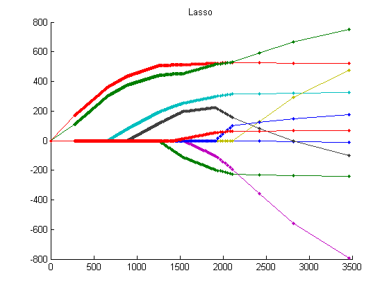
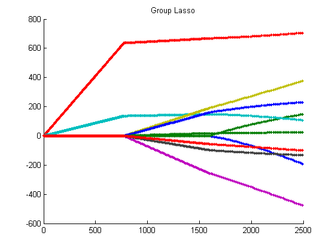

# Lasso
Shooting algorithm implemented in Matlab for solving the Lasso and group Lasso in the penalized form.

Input: a design matrix X, a response vector Y, grouping index G (only required by group Lasso), penalty parameter lambda.
Output: the estimated coefficient vector.

<strong>Example:</strong>
Lasso and group Lasso for the diabetes data set used in [1].

lambda = 100;
b = lassoShooting(X, Y, lambda);
% Grouping index:
% G1: age & sex; G2: BMI & BP; G3: S1-S6;
G = [1 1 2 2 3 3 3 3 3 3];
b_grp = grplassoShooting(X, Y, G, lambda);

% We can solve the Lasso and group Lasso on a set of penalty parameters (example below lambda=0:2:730) with the shooting algorithms.

|  | 
|:--:| 
| *Lasso path* |

|  | 
|:--:| 
| *Group Lasso path* |

<strong>References:</strong>

[1] Fu (1998) Penalized regression: the bridge versus the lasso. J. Comput. Graph. Stats.

[2] Yuan and Lin (2005) Model selection and estimation in regression with grouped variables. JRSSB.

[3] Efron Brad, et al. (2004) Least angle regression. Annals of Statistics, 32(2):407-499.
